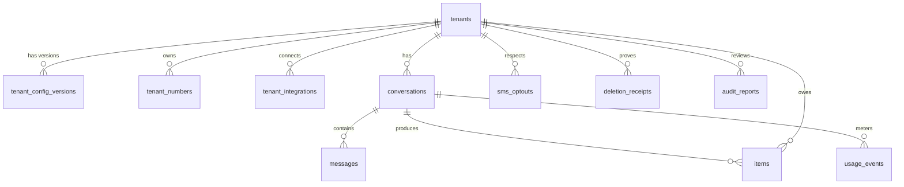

# Data model reference

The complete schema across all five plans. The plan that introduces a table is in brackets. Types are Postgres. Every datetime is `timestamptz`. Every table in the `runtime` schema carries `tenant_id` where the row belongs to a tenant.

## Ownership

| Schema | Owner | Migration tool | Reader |
|---|---|---|---|
| `runtime` | Python runtime | Alembic | runtime only; the portal reads through `/internal/*` |
| `public` | Portal (Wasp) | Prisma | portal only |
| Cloudflare KV | Edge worker | none | worker only |

Row-level security is deferred: the only database client is the runtime process itself, and the portal never connects to the runtime schema. Revisit when a second in-process consumer appears.

## Entity relationships

## Schema `runtime`

### tenants [runtime plan, Task 7]
| column | type | notes |
|---|---|---|
| id | text PK | slug, e.g. `skincentrix` |
| name | text | |
| last_digest_date | date null | last local day a digest was queued |
| created_at | timestamptz | default now |

### tenant_config_versions [Task 7]
| id | serial PK | |
| tenant_id | text FK tenants | |
| version | int | unique with tenant_id |
| config | jsonb | `TenantConfig` JSON, see `tenant-config.md` |
| created_by | text | email or `cli` |
| created_at | timestamptz | |

Index: unique `(tenant_id, version)`.

### tenant_numbers [Task 7]
| number | text PK | E.164 |
| tenant_id | text FK | |
| kind | text | `voice` or `sms` |

### tenant_integrations [instagram plan, D1]
| id | serial PK | |
| tenant_id | text FK | |
| provider | text | `instagram` or `messenger`; unique with tenant_id |
| external_id | text | IG user id or Page id |
| display_name | text | @username or page name |
| access_token_enc | text | Fernet-encrypted |
| token_expires_at | timestamptz null | |
| scopes | text[] | |
| needs_reconnect | bool | default false |
| connected_by | text | |
| created_at, updated_at | timestamptz | |

Index: unique `(tenant_id, provider)`; `(provider, external_id)` for webhook resolution.

### conversations [Task 7; columns added by B2, B5, E5]
| id | uuid PK | |
| tenant_id | text FK | |
| channel | text | `voice`, `sms`, `chat`, `instagram`, `messenger` |
| external_ref | text null | call sid, chat session id, IG sender id, PSID |
| external_session | text null | link to a related conversation (SMS text-back → voice id) |
| caller | text null | E.164 for voice and SMS, null otherwise |
| controller | text | `ai`, `human`, `closed`; default `ai` |
| health_context | bool | default false |
| band | int null | 1, 2, 3 at end |
| latency_ms | jsonb null | list of per-turn ms |
| stage_ms | jsonb null | `{stt, llm, tts}` p95 for the call [E5] |
| started_at | timestamptz | default now |
| last_message_at | timestamptz null | [B2] |
| ended_at | timestamptz null | |
| closed_at | timestamptz null | text channels [B2] |
| followup_sent_at | timestamptz null | the single follow-up [B2] |
| slack_channel, slack_ts | text null | thread root for takeover [B5] |

Indexes: `(tenant_id, started_at desc)`; `(tenant_id, channel, external_ref, last_message_at desc)` for find-or-create; `(slack_ts)`.

### messages [Task 7]
| id | bigserial PK | |
| conversation_id | uuid FK | |
| role | text | `user`, `assistant`, `staff`, `system` |
| text | text | |
| created_at | timestamptz | |

Index: `(conversation_id, id)`.

### items [Task 7; health_context added]
| id | serial PK | short number staff can quote, e.g. `#4821` |
| tenant_id | text FK | |
| conversation_id | uuid FK null | |
| type | text | see enumerations |
| urgency | text | `normal`, `urgent` |
| service_id | text null | catalog id |
| contact_name, contact_phone, contact_email | text null | the only contact fields |
| preferred_window | jsonb | `{date, part_of_day}` |
| channel | text | |
| health_context | bool | default false |
| state | text | `open`, `acknowledged`, `resolved`, `expired` |
| due_at | timestamptz | business-hours arithmetic |
| owner | text | escalation owner email |
| escalated_at, acknowledged_at, resolved_at | timestamptz null | |
| acknowledged_by, resolved_by | text null | |
| created_at | timestamptz | |

There is no free-text column on this table and there must never be one.

Indexes: `(tenant_id, state, due_at)`; partial `(due_at) where state = 'open' and escalated_at is null` for the breach scan.

### usage_events [Task 7]
| id | bigserial PK | |
| tenant_id | text FK | |
| conversation_id | uuid FK null | |
| channel | text | |
| provider | text | `telnyx`, `soniox`, `inworld`, `gemini-2.5-flash`, … |
| unit | text | see enumerations |
| qty | numeric(14,3) | |
| created_at | timestamptz | |

Indexes: `(tenant_id, created_at)`; `(conversation_id)`.

### jobs [Task 7]
| id | bigserial PK | |
| kind | text | see enumerations |
| payload | jsonb | |
| run_at | timestamptz | default now |
| attempts, max_attempts | int | default 0, 5 |
| state | text | `queued`, `done`, `dead` |
| last_error | text null | |
| created_at | timestamptz | |

Index: `(state, run_at)`. Claim query uses `FOR UPDATE SKIP LOCKED`.

### audit_log [Task 7]
| id | bigserial PK | |
| actor | text | email, `link`, `cli`, `portal:<email>` |
| action | text | `read_transcript`, `ack`, `resolve`, `config_save`, `config_rollback`, `export` |
| record_type | text | `conversation`, `item`, `tenant` |
| record_id | text | |
| created_at | timestamptz | |

Index: `(record_type, record_id)`. Retention 2 years.

### inbound_messages [text-channels plan, B2]
| provider_message_id | text PK | dedup key |
| tenant_id | text | |
| channel | text | |
| received_at | timestamptz | |

### sms_optouts [B2]
| tenant_id | text | PK with phone |
| phone | text | E.164 |
| created_at | timestamptz | |

### textbacks [B3]
| id | bigserial PK | |
| tenant_id, phone | text | |
| sent_at | timestamptz | |

Index: `(tenant_id, phone, sent_at desc)`.

### meta_events [instagram plan, D2]
| event_id | text PK | comment id or message mid |
| tenant_id, provider, kind | text | |
| received_at | timestamptz | |

### meta_windows [D2]
| tenant_id, provider, sender_id | text | composite PK |
| last_inbound_at | timestamptz | 24-hour window anchor |

### alert_log [operations plan, Task E1]

Split out of the table below because it is the first operations table that exists: E1's loop
guard writes a row per refused self-call, and E7's `alerts.notify` deduplicates on `key`.

| column | type | notes |
|---|---|---|
| id | bigserial PK | |
| key | text | the incident identity, e.g. `loop_guard:<tenant>:<E.164>`; what dedup keys on |
| subject | text | the one-line summary the alert email carries |
| sent_at | timestamptz | default now |

Index: `(key, sent_at desc)`.

### ops_runs [operations plan, Task E3]

One row per scheduled operations run, written whether or not the run succeeded, so a job
that silently stopped running does not look like one that found nothing to do.

| column | type | notes |
|---|---|---|
| id | bigserial PK | |
| kind | text | the job kind, e.g. `ops.retention` |
| started_at | timestamptz | default now |
| finished_at | timestamptz null | null while the run is in flight or if the process died |
| ok | bool | default false; set true only when the run completed |
| summary | jsonb | what the run did, e.g. the retention counts per tenant |

### deletion_receipts [operations plan, Task E3]

Retention deletes are hard deletes, so the receipt is the only evidence afterwards. One row
per (tenant, kind) per run, and only when the count is non-zero.

| column | type | notes |
|---|---|---|
| id | bigserial PK | |
| tenant_id | text | not a foreign key: a receipt outlives the tenant it accounts for |
| kind | text | `messages`, `conversations`, `items`, `usage_events` |
| count | int | rows deleted |
| cutoff | timestamptz | everything older than this went |
| run_at | timestamptz | the run's clock, not the database's |

### audit_reports, provider_invoices [operations plan]
| table | columns |
|---|---|
| audit_reports | id, day date, tenant_id, report jsonb, created_at; unique `(day, tenant_id)` |
| provider_invoices | id, provider text, month text `YYYY-MM`, amount_cad numeric(12,2), entered_at; unique `(provider, month)` |

## Schema `public` (portal, Prisma) [portal plan]

| model | fields |
|---|---|
| User | id, email unique, username?, isAdmin bool, createdAt (+ Wasp auth tables `Auth`, `AuthIdentity`, `Session`) |
| Organization | id, name, slug unique, runtimeTenantId unique, stripeCustomerId?, subscriptionStatus?, subscriptionPlan?, createdAt |
| Membership | id, userId, organizationId, role `OWNER` or `STAFF`; unique (userId, organizationId) |
| Invitation | id, email, organizationId, role, token unique, expiresAt, acceptedAt? |
| DailyStats, Logs | kept from open-saas for the admin analytics page |

No portal model mirrors a runtime table.

## Cloudflare KV (edge worker) [B1]

| namespace | key | value |
|---|---|---|
| TENANT_TEXTS | `<to E.164>` | `{"tenant_id", "from", "text"}` offline auto-reply per number |
| PENDING | `pending:<message_id>`, `pending:chat:<uuid>` | raw event to replay; 24 h TTL |
| PENDING | `replied:<message_id>` | marker; 7-day TTL |

## Enumerations

- `items.type`: `callback`, `new_booking`, `question`, `training_enquiry`, `reschedule`, `cancel`, `send_link`, `escalation_human_request`, `escalation_clinical`, `escalation_complaint`, `escalation_payment`, `escalation_legal`, `escalation_unsure`.
- `items.state`: `open` → `acknowledged` → `resolved`; `open` → `expired` (set by retention after 400 days, never by the scheduler).
- `items.urgency`: `normal` (due in `standard_business_hours` business hours), `urgent` (due in `urgent_minutes` wall-clock).
- `conversations.band`: 1 handled end to end, 2 captured for a human, 3 straight to a human.
- `conversations.controller`: `ai`, `human`, `closed`.
- `usage_events.unit`: `telephony_seconds`, `stt_seconds`, `tts_chars`, `llm_input_tokens`, `llm_cached_tokens`, `llm_output_tokens`, `sms_in`, `sms_out`, `chat_in`, `chat_out`, `ig_in`, `ig_out`, `fb_in`, `fb_out`.
- `jobs.kind`: `deliver.slack`, `deliver.email`, `digest.email`, `text.followup`, `sms.textback`, `social.ig_event`, `social.fb_event`, `social.refresh_tokens`, `ops.retention`, `ops.nightly_audit`, `ops.cost_report`, `ops.alert`.
- Outcome kinds (not stored, but appear in logs and scenario outputs): `captured`, `link_sent`, `refused`, `completed`, `transferred`.

## Retention (operations plan E3)

| data | default | per tenant |
|---|---|---|
| messages (transcripts) | 30 days after `ended_at` | `retention_days` |
| conversations | stub kept 400 days (no caller, no latency), then deleted | fixed |
| items | 400 days | fixed |
| usage_events | 400 days | fixed |
| audit_log | 2 years | fixed |
| recordings | none exist unless `recording_enabled` (not implemented in these plans) | |
